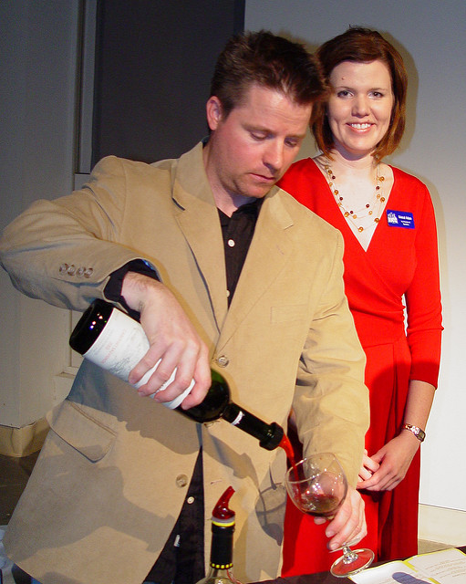
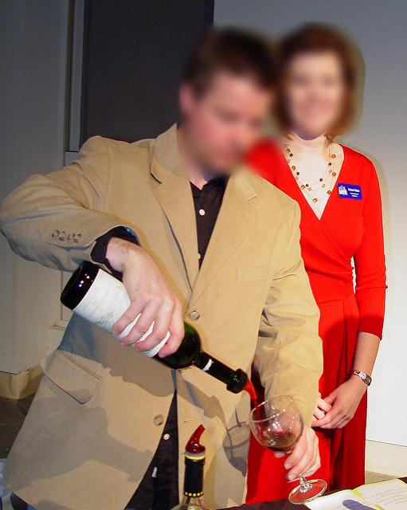
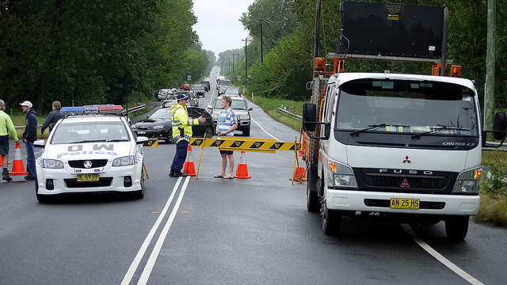
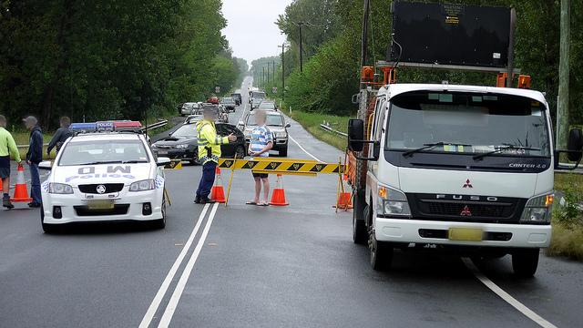

# Anonymizer
An anonymizer for pravicy protection of human faces and vehicle plates. This is a customized fork originally from archived project of [understand-ai](https://github.com/understand-ai/anonymizer). The original code is developed with tensorflow-1.11 which is a fairly old version with poor GPU support in recent GPUs. With some tricks, the [ONNX-RUNTIME](https://onnxruntime.ai/) provides a work around to running on fairly new GPUs (i.e. CUDA 11.*). Guidelines for ONNX-RUNTIME version is [here](#onnx-ify-anonymizer).







You can use this anonymizer to mask your datasets which is selected to publish.

## Installation

- Clone the Repo
  ```shell
  git clone https://github.com/fusionportable/Anonymizer.git
  ```

- Download the [pre-trained weights](https://drive.google.com/drive/folders/1cuu-lvG8Z6j8K9f66vxztk5XzaqRGI-e?usp=drive_link)
  
  ```shell
  # two .onnx files
  face.onnx
  plate.onnx
  ```
- Build Docker Container
  <!-- - Without ROS -->
    ```bash
    # without ros
    docker build . -t anonymizer:ort-1.14-cuda-11.6
    ```

  <!-- - With ROS support
    ```bash
    # build from local
    docker build -t ros-noetic-miniconda:latest .
    # if build failed pull from docker hub
    docker pull 11710414/ros-noetic-miniconda:latest
    ``` -->

- Install Dependencies
  <!-- # conda create --name anonymizer python=3.6 -y
  # conda activate anonymizer
  # cd /workspace/anonymizer -->
  ```shell
  # tested with CUDA11.8 with onnxruntime=1.14
  cd anonymizer
  pip install --upgrade pip
  pip install -r requirements.txt
  ```

## Usage
- Anonymize images
```bash
python3 anonymizer/bin/anonymize_onnx.py \
--input /absolute/path/to/input/images/folder \
--output /absolute/path/to/output/images/folder \ 
--weights /absolute/path/to/weights/folder \ --image-extensions jpg \ 
---face-threshold 0.3 --plate-threshold 0.3 \
--write-detections (default false)
```
- Anonymize rosbags
  ```bash
  TODO
  ```

### TODO:
  - [x] Add docker image with CUDA11.6 compatibility.
  - [ ] Add docker image with ROS1 compatibility.
  - [x] Add instructions on easy run.
  - [x] Add figures for illustration.
  - [ ] Add scripts directly process the rosbags.
  - [ ] Refactor the anonymizer in the same branch that is compatiable to plug in detector and obfuscators.